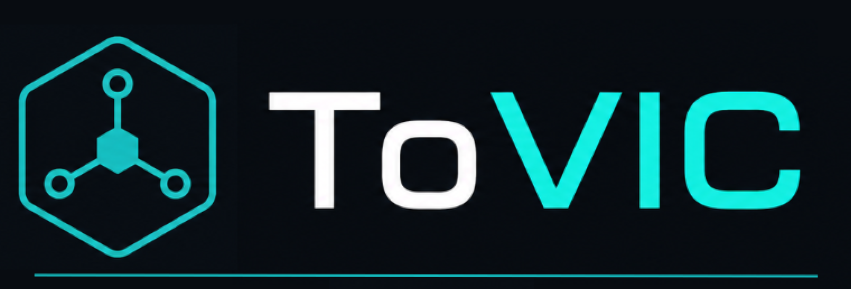

<p align="center">
  
</p>

<h1 align="center">ToVIC</h1>

<p align="center">
  Guild-based grand strategy simulation platform.
</p>

<p align="center">
  <a href="https://woodwepper.github.io/tovic-docs/">Documentation</a>
</p>

## What Is ToVIC?

ToVIC is a strategy simulation project inspired by games like Victoria II and HOI4.
The long-term idea is that each Discord guild can run its own custom world:

- A web interface is used to build, configure and inspect worlds.
- A Discord bot is the main way players issue commands.
- A Python engine is the authority that validates rules and changes game state.
- A database will persist guild worlds, game state, commands and events.

The guiding rule is simple:

> Client requests, engine decides.

The web UI and Discord bot should never mutate the game state directly. They request
actions; the engine validates them, executes them if legal, and emits the result.

## Current Scope

This repository currently focuses on the Python engine foundation:

- World and scenario models.
- Template-based loading.
- Data validation.
- Initial `GameState` creation.
- Victoria2-style default template data.
- CLI/testing utilities for checking the loaded world.

The API, Discord bot, database layer and production web client are part of the
larger platform vision, but they are not the main implementation surface in this
branch yet.

## Project Structure

```text
ToVic/
  .github/       Project vision and agent notes
  data/          Local data space
  loaders/       World/scenario loaders and validators
  menu/          CLI/menu experimentation
  model/         Domain models for world, scenario and state
  simulation/    Simulation package placeholder
  templates/     Default game templates and scenario data
  main.py        Main validation/demo entry point
  tests.py       Manual test and inspection script
```

## Quick Start

From the repository root:

```powershell
python main.py
```

For the manual inspection script:

```powershell
python tests.py
```

If you use a virtual environment, activate it first. If not, the global Python
interpreter works as long as the project imports resolve correctly.

## Core Flow

1. Load a template world from `templates/default_templates`.
2. Load a scenario snapshot for that world.
3. Validate world definitions.
4. Validate scenario data.
5. Create the initial game state.
6. Later, simulation systems process commands and ticks from that state.

## Platform Vision

```text
Web Editor / Web Viewer
          |
          v
        API
          |
          v
  Python Engine Authority
          |
          v
  Game State + Events
          |
          v
 Discord Bot + Web Updates
```

## Logo Assets

The README expects these files:

```text
docs/assets/tovic-logo.png
docs/assets/tovic-logo-mark.png
```

Use `tovic-logo.png` for the horizontal logo and `tovic-logo-mark.png` for the
reduced icon mark.

## Status

ToVIC is in early development. The immediate goal is to keep building the engine
in small, understandable steps before expanding into the full API, bot, database
and web experience.
